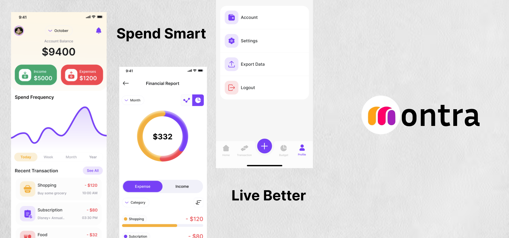

## Montra

### An Expense Tracker Flutter Application! 💰

  

 

# 📲 Features:

- Add expense and income with various category category wise. 📲
- Explore monthly analytics of expense and income with graphs. 📈
- Manage your profile ⚙️
- Filter your expense and income category wise and stay updated with latest income and expense count 🚀
- Monthly, yealy and daily expense analytics 💫

Spend smart and live better with Montra! 

# 📦 Dependencies

- [firebase](https://pub.dev/packages/firebase_core)
- [syncfusion_flutter_charts](https://pub.dev/packages/syncfusion_flutter_charts)
- [skeletonizer](https://pub.dev/packages/skeletonizer)
- [widgetbook](https://pub.dev/packages/widgetbook)
- [circle_nav_bar](https://pub.dev/packages/circle_nav_bar)
- [slang](https://pub.dev/packages/slang)
- [formz](https://pub.dev/packages/formz)

# 🔗 Connect with me

 

# 🤝 Contribution

Contributions are welcome! If you have suggestions, improvements, or bug fixes follow this steps.

1. please open an issue.
2. Fork the repository.
3. Create a new branch (feature-branch)
4. Commit your changes.
5. Push to the branch and submit a pull request.

# 📬 Contact

For any issues or suggestions, open an issue or reach out at this [email](avniprajapati21101@gamil.com)
